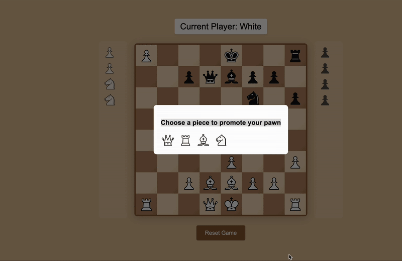

# Chess Game

This is a simple two-player chess game built using HTML, CSS, and JavaScript. The game allows two players to play chess against each other in a web browser.



## Project Structure

```
chess-game
├── index.html        # Main HTML document for the chess game
├── css
│   └── style.css     # Styles for the chess game
├── js
│   └── main.js       # JavaScript code for game logic
├── assets
│   └── icons
│       ├── bishop.svg  # Icon for the bishop piece
│       ├── king.svg    # Icon for the king piece
│       ├── knight.svg   # Icon for the knight piece
│       ├── pawn.svg     # Icon for the pawn piece
│       ├── queen.svg    # Icon for the queen piece
│       └── rook.svg     # Icon for the rook piece
└── README.md          # Documentation for the project
```

## How to Play

1. Open `index.html` in a web browser to start the game.
2. Players take turns moving their pieces according to standard chess rules.
3. The game ends when one player checkmates the other.

## Setup Instructions

To set up the project locally:

1. Clone the repository or download the project files.
2. Open the `index.html` file in your preferred web browser.
3. Enjoy playing chess!

## Technologies Used

- HTML
- CSS
- JavaScript

Feel free to modify the code and enhance the game with additional features!